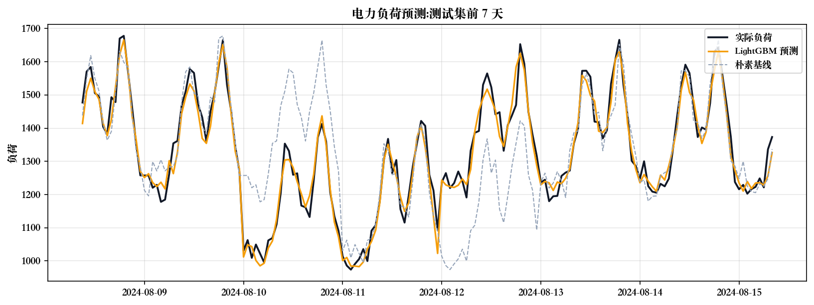
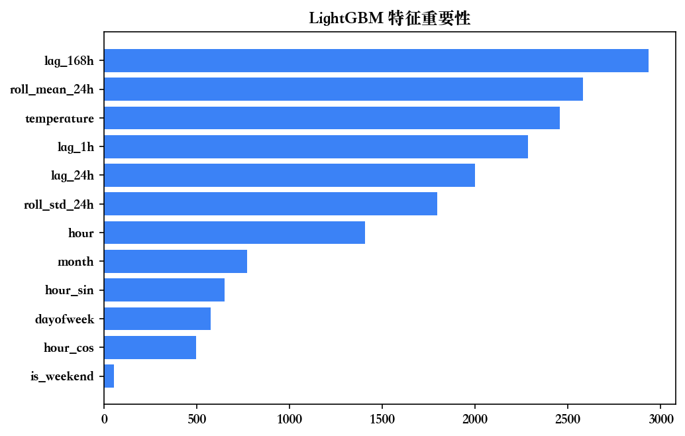

# 电力负荷时序预测（Electricity Load Forecasting）

一个端到端的**时间序列需求预测**项目：基于小时级电力负荷与气象数据，通过特征工程 +
多模型对比，预测未来负荷。面向能源/储能场景的「需求预测」任务。

## 性能对比



| 模型 | MAE | RMSE | MAPE |
|---|---|---|---|
| 朴素基线（昨日同时刻） | 94.08 | 132.49 | 7.33% |
| 线性回归 | 38.13 | 49.35 | 2.91% |
| **LightGBM** | **34.80** | **43.64** | **2.62%** |

**LightGBM 相比朴素基线 MAE 降低 63%，MAPE 2.62%**（负荷预测业界优秀区间为 2–5%）。



特征重要性显示：**滞后特征（昨日/上周同时刻）+ 温度 + 小时**是负荷的主要驱动因素，
与用电的日周期、周周期、天气敏感性的业务规律一致。

## 项目结构

| 文件 | 内容 |
|---|---|
| `generate_data.py` | 生成含真实规律（日/周/季周期 + 温度 + 节假日）的小时级负荷数据 |
| `forecast.py` | 特征工程 + 时序划分 + 三级模型对比 + 评估 + 可视化 |
| `data/load.csv` | 数据（timestamp, load, temperature） |
| `forecast_plot.png` / `feature_importance.png` | 结果图 |
| `metrics.csv` | 三个模型的评估指标 |

## 技术要点

- **时序特征工程**：日历特征、周期性正余弦编码、滞后特征（lag 1h/24h/168h）、滑动统计、气象外生变量
- **正确的时序验证**：严格按时间切分训练/测试，**不随机打乱**（避免未来信息泄漏）
- **多模型对比**：朴素基线 → 线性回归 → LightGBM，体现「特征工程→建模→评估→迭代」全流程
- **评估指标**：MAE / RMSE / MAPE，符合负荷预测行业惯例

## 运行

```bash
pip install pandas numpy scikit-learn lightgbm matplotlib
python3 generate_data.py   # 生成数据
python3 forecast.py        # 训练 + 评估 + 出图
```

